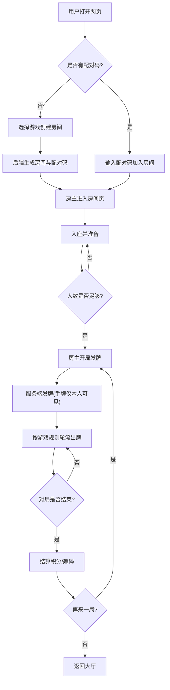

# 家庭棋牌室 - 产品需求文档（PRD）

## 1. 产品概述

家庭棋牌室是一款面向家庭及亲友聚会的网页版多人棋牌游戏平台，支持斗地主、炸金花、牛牛三款经典扑克游戏。
- 解决家庭/亲友远程聚会时缺乏优质、私密棋牌游戏的问题，通过配对码进入房间，安全可控
- 采用服务端权威架构：玩家手牌仅存于服务端，前端只收到自己的手牌与公开的出牌，从根本上杜绝 Hook 解密偷牌
- 兼容手机与电脑浏览器访问，一次部署即可全家人随时随地开桌

## 2. 核心功能

### 2.1 用户角色
| 角色 | 进入方式 | 核心权限 |
|------|----------|----------|
| 房主 | 后端创建房间获得配对码 | 选择游戏、开局、踢人、解散房间 |
| 普通玩家 | 输入配对码加入房间 | 入座、出牌、跟注、弃牌、聊天 |
| 旁观者 | 输入配对码但未入座 | 观战、聊天，不参与出牌 |

### 2.2 功能模块
1. **大厅首页**：游戏选择入口、房间加入、规则说明
2. **房间页**：座位、玩家信息、手牌区、出牌区、操作栏、聊天
3. **结算页**：单局结算弹窗、积分榜

### 2.3 页面详情
| 页面名称 | 模块名称 | 功能描述 |
|----------|----------|----------|
| 大厅首页 | 品牌英雄区 | 标题、副标题、背景动效 |
| 大厅首页 | 游戏卡片 | 斗地主/炸金花/牛牛三张卡片，点击进入对应游戏房间创建 |
| 大厅首页 | 加入房间 | 输入 6 位配对码加入既有房间 |
| 大厅首页 | 规则说明 | 三款游戏规则手风琴展开 |
| 房间页 | 房间头栏 | 房间号、当前游戏、房主、复制配对码 |
| 房间页 | 座位区 | 3-4 个座位，显示玩家昵称、头像、积分、是否准备、剩余牌数 |
| 房间页 | 中央出牌区 | 展示当前轮次出的牌、底牌（斗地主）、奖池（炸金花） |
| 房间页 | 我的手牌 | 仅显示自己的手牌，可选中、排序、出牌 |
| 房间页 | 操作栏 | 准备/出牌/不要/跟注/加注/弃牌/看牌/比牌（按游戏类型动态切换） |
| 房间页 | 聊天框 | 文字聊天、快捷语、表情 |
| 房间页 | 结算弹窗 | 单局结束显示胜负、积分变化、再来一局/返回大厅 |

## 3. 核心流程

### 3.1 创建并加入房间
房主在大厅选择游戏 → 后端创建房间并返回配对码 → 房主进入房间 → 其他玩家输入配对码加入 → 入座并准备 → 房主点开局。

### 3.2 斗地主对局流程
3 人入座并准备 → 开局发牌（每人 17 张，留 3 张底牌）→ 叫地主（随机/抢地主）→ 地主获得底牌（底牌信息公开）→ 地主先出牌 → 轮流出牌/不要 → 谁先出完谁所在阵营胜利 → 结算积分。

### 3.3 炸金花对局流程
3-6 人入座并准备 → 开局每人发 3 张暗牌 → 轮流下注（看牌/闷牌/跟注/加注/弃牌/比牌）→ 最后未弃牌者胜或比牌胜者胜 → 展示赢家手牌 → 结算筹码。

### 3.4 牛牛对局流程
4 人入座并准备 → 庄家轮转 → 每人发 5 张牌 → 玩家从 5 张中选 3 张凑 10 的倍数（牛），剩 2 张比大小 → 计算倍数 → 闲家依次与庄家比牌 → 结算筹码。

### 3.5 流程图

## 4. 用户界面设计

### 4.1 设计风格
- **整体定位**：高端复古赌场牌桌 + 现代毛玻璃质感，深绿牌桌呢绒为底，金色描边点缀，营造家庭牌局的庄重与温馨
- **主色**：深翡翠绿 `#0B3D2E` 牌桌底 + 墨绿 `#072018` 渐变背景
- **辅色**：暖金 `#D4AF37` 描边/按钮高光、酒红 `#8B2635` 警示/地主标识
- **文字色**：象牙白 `#F4F1E8` 主体、淡金 `#E8D9A0` 次级
- **按钮**：圆角 12px、金色渐变描边、按压微下沉阴影、悬停发光
- **字体**：标题用 `Cinzel`（复古衬线）/ 中文用 `Noto Serif SC`；正文用 `Noto Sans SC`；牌面用 `Playfair Display`
- **布局**：牌桌为中心的圆桌放射布局，自己手牌居底，其他玩家分居左/上/右
- **图标/表情**：使用简洁线性图标 + 扑克花色 ♠♥♦♣ 实心字符
- **动效**：发牌飞入、出牌滑入中央、选中卡牌上浮、获胜金币雨、毛玻璃背景流光

### 4.2 页面设计概览
| 页面名称 | 模块名称 | UI 元素 |
|----------|----------|----------|
| 大厅首页 | 英雄区 | 深绿渐变背景+金色粒子，Cinzel 大标题"家庭棋牌室"，副标题，CTA 按钮 |
| 大厅首页 | 游戏卡片 | 三张毛玻璃卡片横排（移动端纵排），每张含游戏图标、名称、人数、简介、进入按钮 |
| 大厅首页 | 加入房间 | 居中卡片，6 位分格配对码输入框，加入按钮 |
| 房间页 | 牌桌区 | 椭圆墨绿牌桌，金边，四个座位环绕，中央出牌区带光晕 |
| 房间页 | 手牌区 | 底部弧形排列卡牌，点击上浮选中，可拖拽排序 |
| 房间页 | 操作栏 | 底部金边按钮组，按游戏动态显示 |
| 房间页 | 头部信息栏 | 顶部毛玻璃条，左房间号右配对码复制按钮 |
| 结算弹窗 | 结算卡片 | 居中金边卡片，胜负标题、积分变化、再来一局按钮 |

### 4.3 响应式
- **桌面优先**：以 1280px 宽牌桌横版布局为基准设计
- **移动适配**：≤768px 时座位压缩到手牌两侧竖排，操作栏置底吸顶，卡牌缩小为可横滑
- **触控优化**：卡牌点击区域 ≥44px，出牌按钮间距充足防误触，支持长按看牌（炸金花）

### 4.4 安全设计说明（防偷牌）
- **服务端权威**：所有玩家手牌仅存在于服务端内存，下发的消息中只有「自己」的手牌
- **其他玩家**：前端只收到其剩余牌数、是否看牌、下注状态，绝不下发其手牌
- **对局结束后**：才公开赢家（及炸金花比牌时双方）的手牌
- **传输层**：WebSocket 使用 wss（生产）+ 消息体 JSON；因服务端不发他人手牌，前端无需加密也天然安全
