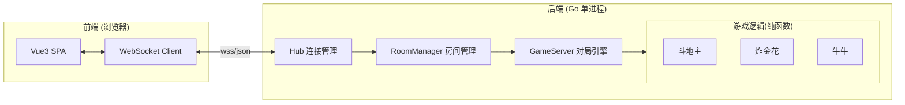
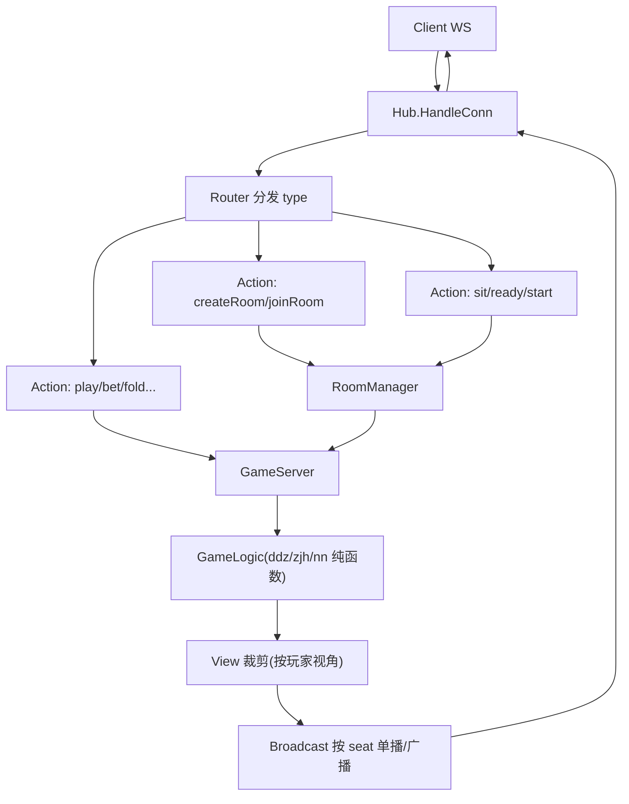
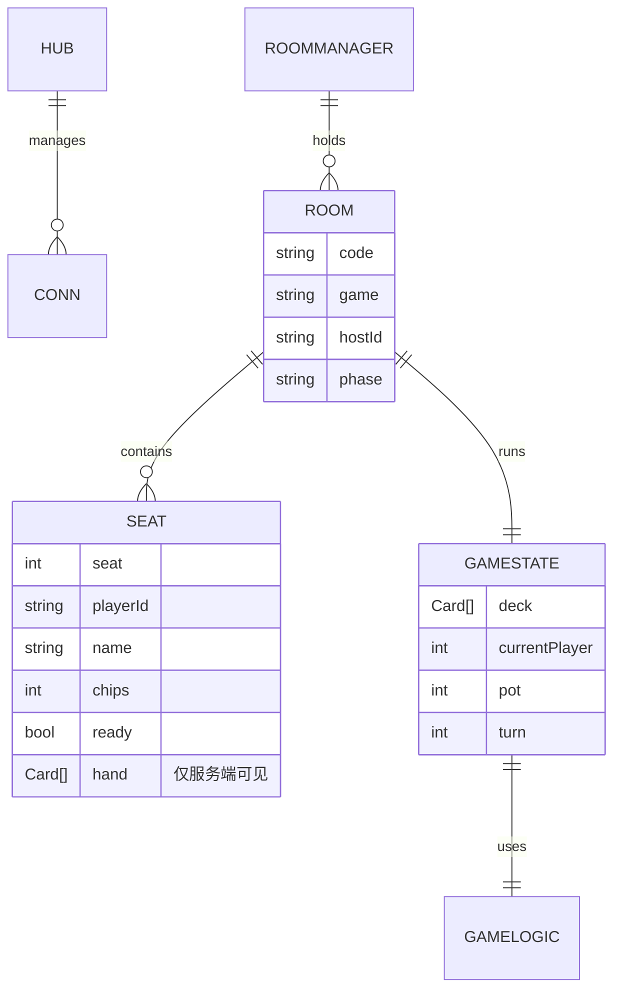

# 家庭棋牌室 - 技术架构文档

## 1. 架构设计

采用前后端分离 + 服务端权威架构。前端为 SPA，通过 WebSocket 与后端实时通信；后端为单进程 Go 服务，房间与对局状态全部保存在内存（家庭场景无需持久化）。



**核心安全原则**：手牌只在 `GameServer` 内存中，发往某个客户端的消息由 `GS` 按玩家视角裁剪——只含该玩家手牌 + 公开信息（出牌、剩余牌数、下注）。其他玩家手牌永不下发，前端无密文可解。

## 2. 技术说明

- **前端**：Vue 3 + Vite + Pinia + Vue Router + TypeScript；样式用原生 CSS 变量 + 少量作用域样式（不引入 Tailwind 以保持牌桌定制感）
- **后端**：Go 1.21 + `github.com/gorilla/websocket` + 标准库 `net/http`
- **通信协议**：单一 WebSocket 长连接，消息为 JSON `{type, data}`；后端为权威方，前端只发「动作」，后端推「事件」
- **状态存储**：纯内存 map（房间/对局），进程重启即清空——符合家庭临时开桌场景
- **无数据库**：用户用临时昵称 + 配对码，无注册登录

## 3. 路由定义（前端）

| 路由 | 用途 |
|------|------|
| `/` | 大厅首页：游戏选择、加入房间、规则说明 |
| `/room/:code` | 房间页：牌桌、手牌、操作、聊天 |

## 4. API 定义（WebSocket 消息）

所有消息统一结构：`{ "type": string, "data": object }`。下面列出 `type` 与对应 `data`。

### 4.1 客户端 → 服务端（动作 Action）

| type | data | 说明 |
|------|------|------|
| `enter` | `{name}` | 进入大厅/建立连接时上报昵称 |
| `createRoom` | `{game: "ddz"\|"zjh"\|"nn"}` | 创建房间，返回配对码 |
| `joinRoom` | `{code, name}` | 用配对码加入房间 |
| `sit` | `{seat}` | 入座 |
| `stand` | `{}` | 离座 |
| `ready` | `{}` | 准备 |
| `start` | `{}` | 房主开局 |
| `play` | `{cards: [card...]}` | 出牌（斗地主/牛牛） |
| `pass` | `{}` | 不要（斗地主） |
| `callLandlord` | `{call: bool}` | 叫/不叫地主 |
| `look` | `{}` | 看牌（炸金花） |
| `bet` | `{amount}` | 跟注/加注（炸金花） |
| `fold` | `{}` | 弃牌（炸金花） |
| `compare` | `{target}` | 比牌（炸金花） |
| `niuniuSet` | `{cards: [3张]}` | 牛牛选 3 张凑牛 |
| `chat` | `{text}` | 聊天 |
| `leave` | `{}` | 离开房间 |

### 4.2 服务端 → 客户端（事件 Event）

| type | data | 说明 |
|------|------|------|
| `roomCreated` | `{code}` | 房间创建成功 |
| `roomState` | `{见 4.3}` | 全量房间状态（视角裁剪后） |
| `error` | `{msg}` | 错误提示 |
| `deal` | `{cards: [card...]}` | 发给自己手牌（仅本人） |
| `played` | `{player, cards}` | 某玩家出牌（公开） |
| `turn` | `{player, actions: [...]}` | 轮到某人，可执行动作列表 |
| `phase` | `{phase, extra}` | 阶段切换（叫地主/下注/比牌等） |
| `reveal` | `{player, cards}` | 公开某玩家手牌（仅结算/比牌时） |
| `settle` | `{results: [{player, delta}]}` | 结算 |
| `chat` | `{player, text}` | 聊天广播 |

### 4.3 roomState 数据结构（视角裁剪）
```ts
interface RoomState {
  code: string
  game: "ddz" | "zjh" | "nn"
  hostId: string
  phase: "waiting" | "playing" | "settled"
  seats: Array<{
    seat: number
    playerId: string      // 自己时为 "me"
    name: string
    avatar: string
    chips: number
    ready: boolean
    cardCount: number     // 仅剩余张数，绝无手牌
    isLandlord?: boolean
    isDealer?: boolean    // 牛牛庄家
    isFolded?: boolean
    isLooked?: boolean    // 炸金花是否看牌
    online: boolean
  }>
  // 仅 phase==="playing" 时本玩家收到自己的 deal 消息
  publicArea: {
    lastPlay?: { player: string; cards: Card[] }  // 当前轮最大牌
    bottomCards?: Card[]                          // 斗地主底牌(叫地主后公开)
    pot?: number                                  // 炸金花奖池
    currentPlayer?: string
  }
}
interface Card { suit: "♠"|"♥"|"♦"|"♣"; rank: string; value: number }
```

## 5. 服务器架构图



- **Hub**：管理所有 WebSocket 连接，connID ↔ playerID 映射
- **RoomManager**：roomCode → Room，创建/加入/离开，房间内玩家集合
- **GameServer**：持有当前对局状态（牌堆、各玩家手牌、轮次、下注），调用 GameLogic 校验动作并推进，产出事件
- **GameLogic**：纯函数包，三个游戏各一套规则（发牌、合法牌型判定、比较大小、结算倍数），无副作用，便于测试
- **View 裁剪层**：在广播前按每个接收玩家过滤——这是安全核心，确保他人手牌不出服务器

## 6. 数据模型（内存）

### 6.1 关键结构关系


### 6.2 内存数据定义（Go 伪码）
```go
type Card struct{ Suit, Rank string; Value int }
type Seat struct{
    Seat int; PlayerID, Name string; Chips int
    Ready bool; Hand []Card  // 仅服务端持有
    IsLandlord, IsDealer, IsFolded, IsLooked bool
}
type Room struct{
    Code, Game, HostID, Phase string
    Seats [6]*Seat            // 最多 6 座(炸金花)
    State *GameState          // 对局状态，未开局为 nil
}
type GameState struct{
    Deck []Card
    Bottom []Card             // 斗地主底牌
    CurrentSeat int
    LastPlay *Play            // 当前最大出牌
    Pot, BaseBet, CurrentBet int
    Turn, Round int
}
```

无需 DDL（无数据库）。进程内存即全部状态，重启清空，符合家庭临时开桌用途。
